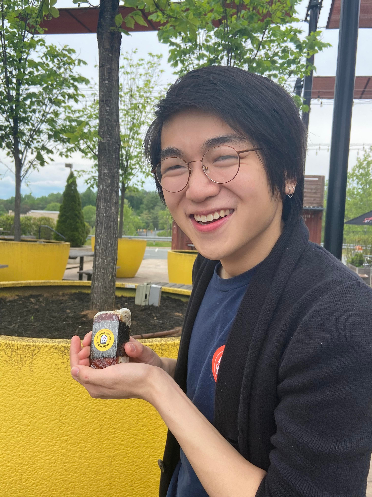

Hi! 

My full name is **Nicholas Ruiyuan Wu.** Most people just call me **Nick.** Sometimes they call me *Nick Wu.*

I am a PhD student at the [University of Maryland](https://maryland.edu/)'s [Applied Mathematics and Scientific Computation (AMSC) program.](https://amsc.umd.edu) Before that, I did my bachelor's at the [University of Virginia](https://www.virginia.edu/). There, I was very fortunate to be mentored by [Prasanna Balachandran](https://engineering.virginia.edu/balachandran-group/team) and [Anil Vullikanti](https://biocomplexity.virginia.edu/person/anil-vullikanti).

As of now, I am broadly interested in mathematical modeling, statistics & probability, and optimization. I am trying to learn more about multi-agent reinforcement learning.

In my free time, I enjoy playing and listening to music (especially jazz and jazz-adjacent things). I played the saxophone in [UVA's Jazz Ensemble](https://www.youtube.com/watch?v=VESyseJabG4). I also used to upload [music videos on YouTube.](https://www.youtube.com/sladjkf)

Email: `[first letter of first name][last name]123@umd.edu`
